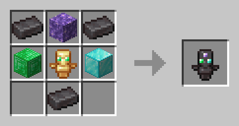
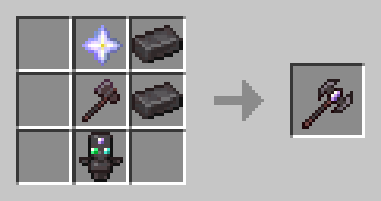
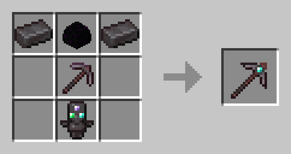
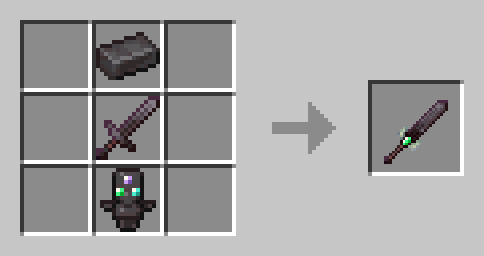
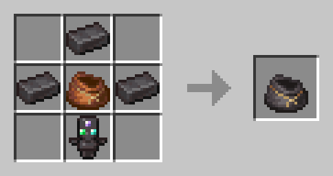
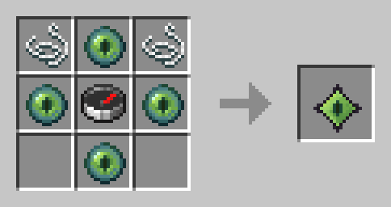
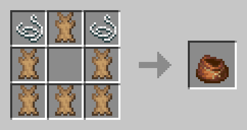

<h1>Balanced-Minecraft-Hardcore 1.20.4  </h1>

 </h1>

Balanced Minecraft Hardcore (BMH) gives you flexibility in difficulty by replacing death by distant respawn based on your difficulty and **Eternal Items** possessed. BMH is the perfect middle ground between normal Minecraft gameplay and hardcore minecraft gameplay.

## Features

### Dying Mechanic

Balanced Minecraft Hardcore (BMH) gives you flexibility in difficulty by replacing death by distant respawn based on your difficulty and Eternal Items possessed.

### Eternal Items

Eternal items stay with even after you die, but loose some durability when you die. They are very very powerful items and you can only carry one type at the time.

### Navigation

No coordinates, it means that you have to craft some special items to know where to go.

### Sleeping

Sleeping is now slightly revamped, it can give you buff if you sleep well.

## Items

### Eternal Items

#### Totem of Eternity

The Totem of Eternity is only used to craft other eternal items

  

#### Eternal Tools

- Eternal Axe
- Eternal Pickaxe
- Eternal Sword

  
  
  

#### Eternal Bundle

Just like the legacy Bundle but keep with you any item inside it even after you die.

  

### Normal Items

#### Navigator's Amulet

Your only way of knowing coordinates in your world. Right click and the coordinates is displayed for few seconds on your screen.

  

#### Bundle

Legacy minecraft bundle implementation.

  

## GameRules

- randomDeathSpawnPoint (default : true)
- displayTextOnRespawn (default : true)
- foodAndHealthRegenOnWakeUp (default : true)
- onlyCarryOneEternalItemType (default : true)
- damageEternalItemWhenDead (default : true)
- removeCoordinatesInSurvival (default : true)

## More Information

Most of the features are not actives when in creative mod.

---

> Looking for a fabric port ? Then Do it.
