# Balanced Minecraft Hardcore for Horizon 26.3

Death sends you far from home. Your world survives, and your Eternal Items travel with you.
Start a Survival world and leave **Balanced Hardcore** enabled on the Game tab.

## Install

This branch targets Horizon Nightly `nightly-source/2026-11-08-fdc87ae`.
The distribution contains the content pack and the native Rust mod. Use both in the same Horizon instance.

1. Extract `bmh-1.9.0-horizon-26.3.zip` into the instance's game directory. Keep the two folders from the ZIP.
2. Enable Balanced Minecraft Hardcore on the instance's Mods tab. Build the native mods in the launcher.
3. Start that instance. For LAN play, install the same files on the host and each guest.

## Run from this checkout

Use the prepared Minecraft 26.3 files and the pinned tools in the BMH cache.

```sh
sh horizon/tools/play.sh --build
```

The game keeps its worlds under `~/Library/Caches/bmh-horizon/play/game/saves`.
Build the distribution with `python3 horizon/tools/package.py`. It writes the ZIP under `horizon/build/`.
For a fresh machine, follow the [game preparation instructions](docs/horizon/TESTING.md).

## Features

### Dying Mechanic

When you die, you respawn far from your bed (or from the world spawn), on a safe spot of solid ground, with only what you could protect. The harder the difficulty, and the more Eternal Items you carry, the farther you wake. You take no damage for 10 seconds after the respawn.

<p align="center">
  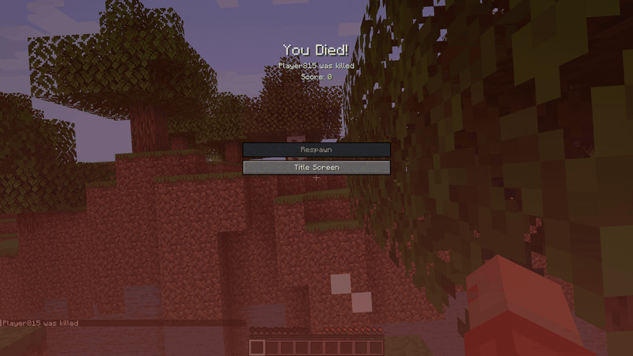
</p>

<p align="center">
  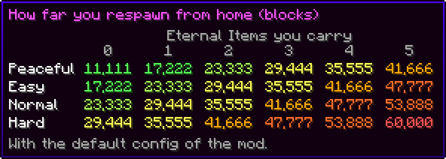
</p>

The distances come from the mod config (`minDistanceFromBed` and `maxDistanceFromBed`).

### Finding Your Way

In Survival, the F3 screen hides your coordinates. The Navigator's Amulet is your only way to know where you are and where your places are, after a distant respawn or after a long exploration.

- **Mark your places:** sneak and use the amulet on a bed or a lodestone to name a point there. You keep up to 5 points (mod config `maxAmuletPoints`). The same click on a point renames or removes it. Sneak and use the amulet anywhere else to see the list of your points and remove one, even when its bed or lodestone is gone.
- **Read the stars:** at night, under open sky and without rain, use the amulet. Your coordinates show on the action bar, and a line of stars points toward each of your points and, a little lighter, toward the world spawn (the first place of your world) for 30 seconds.
- **Know which line is which:** look at the last star of a line through a spyglass to see the name of its point. The line toward the world spawn has no name.
- **Limits:** a reading costs one of 3 starlight charges, which come back at every nightfall. The rest of the time, the needle only points north.

<p align="center">
  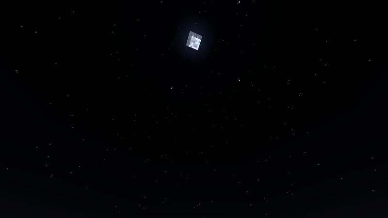
</p>

<p align="center">
  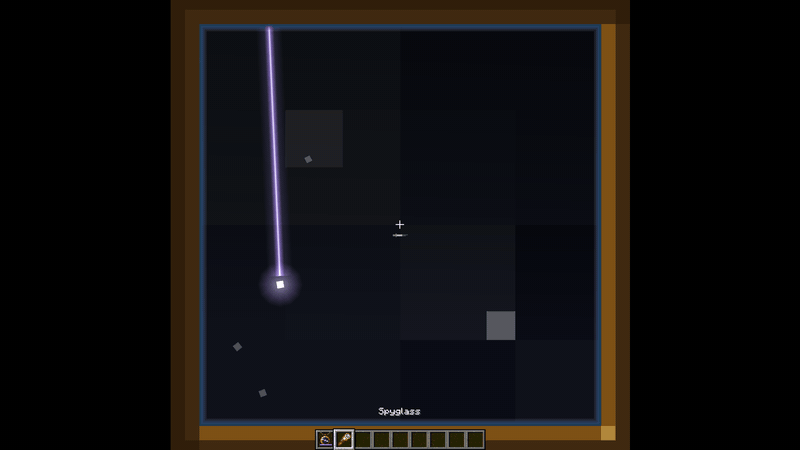
</p>

<p align="center">
  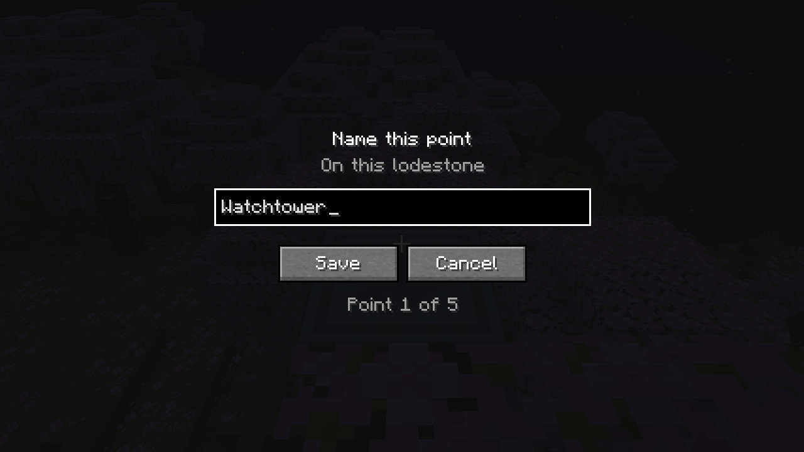
</p>

### Eternal Items

Eternal Items stay with you after you die. Each death costs the Eternal tools 7% of their durability, but they never break. They are very very powerful items and you can carry only one of each. Each one you carry also pushes your next respawn farther away.

<p align="center">
  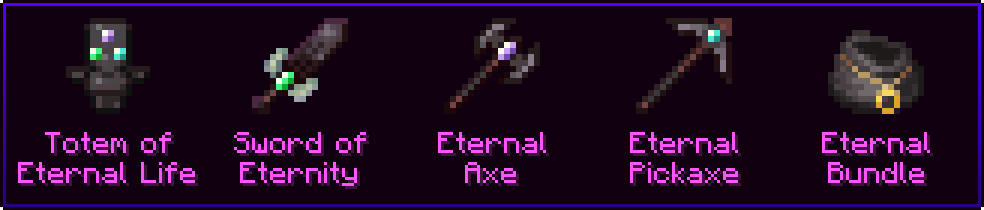
</p>

Dropped Eternal Items have an extended lifetime. Cactus and explosions can still damage them on Horizon.

### Totem of Undying

The Totem of Undying still saves you with Regeneration and Absorption, but it no longer gives Fire Resistance.

### Sleeping

Sleeping is now slightly revamped, it can give you buff if you sleep well.

## Items

### Eternal Items

#### Totem of Eternal Life

The heart of every Eternal Item, made in three steps:

1. Craft a **Hollow Totem of Eternal Life** (the old totem recipe).
2. Craft an **Echo Heart** from a nether star, echo shards and crying obsidian.
3. Awaken the totem at an anvil: Hollow Totem on the left, Echo Heart on the right, for 39 levels.

The awakened totem glows like an enchanted item. It is the smithing template of the Eternal tools and the core of the Eternal Bundle.

Hold the awakened totem in either hand. It saves you once and gives Fire Resistance. A Totem of Undying in the other hand takes priority.

After it saves you, it falls asleep: it becomes a **Dormant Totem of Eternal Life**. The Dormant Totem cannot save you, but it is still an Eternal Item: it stays with you when you die. Only the moon can wake it. At night, under open sky, hold use with the Dormant Totem and look at the moon. For 15 seconds your levels drain, 30 levels in all, while a chime climbs and the totem trembles more and more, and then the totem is awake again. The ritual must be done in one go: if you let go, look away, get hurt, lose the moon or run out of levels, the totem stays asleep and the levels already drained are gone.


<p align="center">
  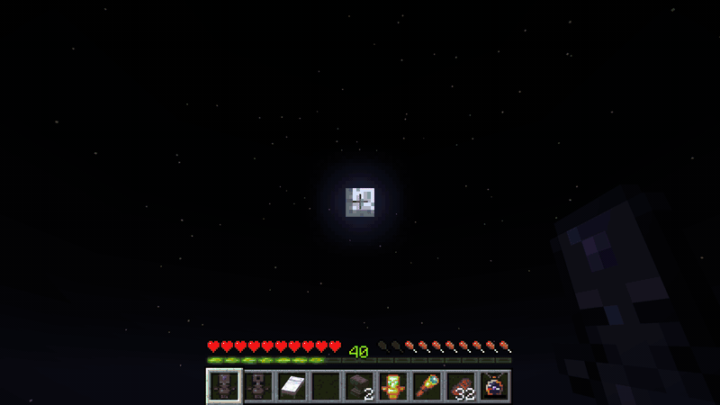
</p>

<p align="center">
  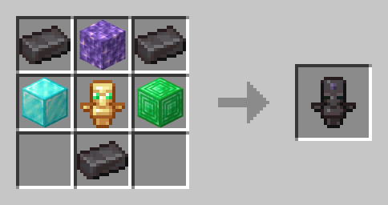
  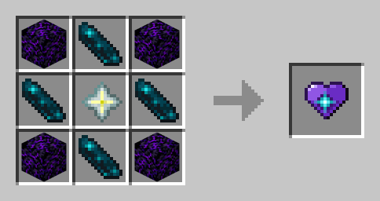
  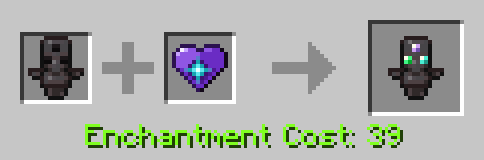
</p>

#### Eternal Tools

Upgrade a netherite sword, axe or pickaxe at a smithing table: Totem of Eternal Life in the template slot, then the tool, then an echo shard. The tool keeps its enchantments, its name and its wear. Eternal tools never break. At their last point of durability they are worn out: they deal half damage, mine at the speed of a stone tool and lose their ability. Repair them at an anvil with gold blocks (always 15 levels, and never "Too Expensive") or with Mending. Each one has its own ability:

- **Eternal Sword, Echo Strike:** a full-strength hit echoes onto the nearest other hostile mob within 5 blocks, for half the damage.
- **Eternal Axe, Smash:** a hit while you fall lands harder the longer the fall, up to 3 times the damage, and the blow halves your fall damage.
- **Eternal Pickaxe, Echo Sense:** breaking an ore makes the same ore within 8 blocks glow through walls for 5 seconds.

<p align="center">
  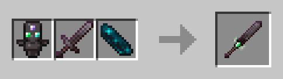
  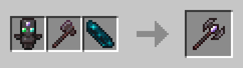
  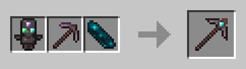
</p>

#### Eternal Bundle

Just like the legacy Bundle but keep with you any item inside it even after you die.

<p align="center">
  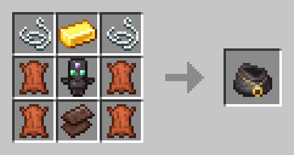
</p>

### Normal Items

#### Navigator's Amulet

How to use it: see Finding Your Way, under Features.

<p align="center">
  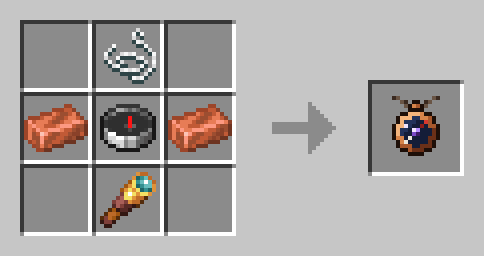
</p>

#### Bundle

Legacy minecraft bundle implementation.

<p align="center">
  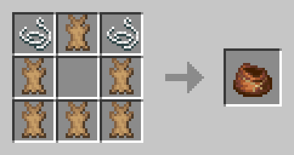
</p>


## World rules

Use `/bmh rule` to list the six rules. Operators can change a rule for the current world.
For example, `/bmh rule display_text_on_respawn false` hides the respawn text.
The mod stores the values in the world's `bmh/rules.txt`.

The [Horizon compatibility notes](docs/horizon/GAPS.md) describe differences from the Java mod.
The feature images above show the Java edition.
